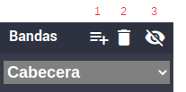
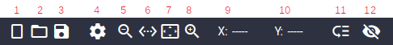

= NimbusPDF
:toc: left
:toc-title: Tabla de contenidos
:nofooter:
:source-highlighter: coderay

== Introducción

NimbusPDF es una extensión de Prawn para generar un tipo especial de informes. La nomenclatura que se usará es la siguiente: un informe es el PDF final que obtendremos, éste estará compuesto de uno o más documentos y un documento se basa en una plantilla (Hash) con información de su estructura, de sus bandas y de los elementos contenidos en ellas. Las plantillas se pueden generar a mano (definiendo el hash correspondiente) o través de una herramienta gráfica que facilita la definición y ubicación de cada elemento dentro del documento. +
Un informe podría ser, por ejemplo, un listado de facturas. En este caso cada factura sería un documento y el informe sería la colección de dichos documentos. El documento tendría las tres típicas bandas: cabecera, detalle y pie. +
Otro ejemplo práctico sería la cumplimentación de un impreso basado en una plantilla. En este caso bastaría con que el documento tuviera sólo una banda de cabecera que ocupara toda la página con la ubicación de los campos necesarios.

== Estructura de un documento
Un documento se basa en un hash (o su correspodiente fichero YAML). Las claves de primer nivel del hash, a las que llamaremos secciones, son a su vez hashes conteniendo las opciones necesarias. Son las siguientes:

* *def*: Contiene los valores por defecto que se usarán en el diseñador gráfico.

* *pag*: En esta sección se definen las propiedades de la página (tamaño, orientación, márgenes, etc.). Es importante tener en cuenta que los márgenes izquierdo y derecho son ignorados. Las posiciones de los distintos elementos son siempre referidas a los bordes absolutos de la página. Por otro lado, los márgenes superior e inferior, sólo sirven para delimitar la zona válida dónde se irán alojando las distintas bandas de detalle. Las bandas de cabecera y pie no están sujetas a ningún margen, todos sus elementos se referencian en coordenadas absolutas. Otro elemento importante en esta sección es la imagen de fondo, que se pintará en todas las páginas del documento. Se posicionará en el vértice superior izquierda y se dimensionará que para ocupe lo máximo posible sin alterar el aspect-ratio. Si el path empieza por "/" se buscará con ese path absoluto en el sistema de ficheros del servidor, si empieza por "~/" se buscará desde el home del proyecto, en cualquier otro caso, se buscará relativa a la situación del archivo del documento (yml). +
Para usar un PDF como imagen de fondo (algo haitual en plantillas preimpresas) deberemos
convertir el pdf a png. La forma más simple es usar el siguiente comando: +
`+pdftoppm input.pdf outputname -png+` +
Si hiciera falta mayor resolución (densidad dpi) se puede usar +
`+pdftoppm input.pdf outputname -png -r 300+` +
Por defecto usa  una dpi de 150, que en general es suficiente, e incluso
para que no ocupe mucho el pdf final hasta se podría bajar un poco: +
`+pdftoppm input.pdf outputname -png -r 120+` +
El comando pdftoppm es parte de la suite poppler-utils. Si no está instalado hay que instalarlo con +
`+yum -y install poppler-utils+`

* *cab*: Es la banda de cabecera. Aquí se declaran todos los elementos de la banda. Esta banda se pintará la primera en todas las páginas del documento. Es un hash donde cada clave es el nombre (alias) de un elemento y su valor es otro hash con sus propiedades. Éstas son:
  ** *at*: Es un array con dos elementos. La coordenada X (referida desde el borde izquierdo) y la coordenada Y (referida desde el borde inferior). Las coordenadas se refieren al vértice superior izquierdo del elemento,
  ** *width*: Anchura del elemento.
  ** *height*: Altura del elemento.
  ** *texto*: Texto a mostrar en el elemento. Lo normal es darle valor por programa, pero también se puede asignar aquí uno estático.
  ** *align*: Alineación horizontal: 'left'. 'center', 'right', 'justify'. (Deafult 'left').
  ** *valign*: Alineación vertical: 'top'. 'center', 'bottom'. (Deafult 'top').
  ** *font*: 'Helvetica', 'Times-Roman', 'Courier', 'Symbol', 'ZapfDingbats' o definido por el usuario (Deafult 'Helvetica').
  ** *style*: Estilo del font: 'normal'. 'bold', 'italic', 'bold_italic'. (Deafult 'normal').
  ** *size*: Tamaño del font (Default: 12)
  ** *overflow*: Indica el comportamiento si el texto no cabe en el elemento (Default 'truncate'). Posibles valores:
  *** truncate: Trunca el texto si no cabe.
  *** shrink_to_fit: Reduce el font hasta que quepa todo el texto. El font se reducirá hasta llegar a lo indicado por el parámetro _min_font_size_. A partir de ahí, si el texto siguiera sin caber, se truncaría.
  *** expand: El elemento se agrandará en altura hasta que quepa el texto.
  ** *min_font_size*: Tamaño mínimo del font (Default: 5).
  ** *leading*: Espaciado entre líneas (Default: 0).
  ** *imagen*: Path a un archivo de imagen. La imagen se ajustará para que se acomode el top-left del elemento manteniendo el aspect-ratio. Si el path empieza por "/" se buscará con ese path absoluto en el sistema de ficheros del servidor, si empieza por "~/" se buscará desde el home del proyecto, en cualquier otro caso, se buscará relativa a la situación del archivo del documento.
  ** *color*: Color del texto (Default "#000000").
  ** *bgcolor*: Color del fondo (Default "#ffffff").
  ** *borde*: Grosor del borde (Default 0).
  ** *brcolor*: Color del borde (Defualt "#000000").
  ** *pad_l*: Distancia desde el borde izquierdo del elemento hasta su contenido (Default 0).
  ** *pad_r*: Distancia desde el borde derecho del elemento hasta su contenido (Default 0).
  ** *pad_t*: Distancia desde el borde superior del elemento hasta su contenido (Default 0).
  ** *pad_b*: Distancia desde el borde inferior del elemento hasta su contenido (Default 0).
  ** *render*: Si vale "auto" (Default) el elemento se renderizará normalmente al añadirse la banda. Si vale "manual", no se renderizará, salvo que lo forcemos explícitamente con el método _pon_elementos_. La utilidad de esto es para evitar que se rendericen elementos que contienen información que no se conoce en el momento de ir generando el documento, y que se conoce y se renderiza a posteriori (como por ejemplo el número total de páginas del documento o del informe).
* *pie*: Banda de pie. Esta banda se pintará después de renderizar cada página del documento. Es un hash donde cada clave es el nombre (alias) de un elemento y su valor es otro hash con sus propiedades. Éstas son las mismas que en la banda de cabecera.
* *draw*: Es una banda especial que contiene sólo líneas horizontales y/o verticales. Se pintará en cada página del documento. Es un hash donde cada clave es el nombre (alias) de un elemento y su valor es otro hash con sus propiedades. Éstas son un subconjunto de las de la banda de cabecera: _at_, _width_, _height_ y _color_.
* *ban*: Es un hash, conteniendo bandas de detalle. Cada clave es el nombre de una banda y su valor es similar al de las bandas de cabecera o pie. El subconjunto de propiedades permitidas es el siguiente: _at_ (en este caso sólo se hará uso de la coordena X), _width_, _align_, _font_, _style_, _size_, _leading_ y _color_. Las bandas de detalle se irán añadiendo entre los márgenes superior e inferior y cada uno de sus elementos se expandirá en altura para acomodar el texto.

Todas las medidas (posición, grosor, tamaño de fuente, etc.) se expresan en "puntos". Un punto equivale a 1/72 de pulgada.

== Ejemplo práctico

Para ilustrar el funcionamiento nos vamos a basar en el informe "modulos/nimbus-core/app/controllers/l_divisas_paises_controller.rb". Para hacer un informe hay que hacer un controlador como si se tratara de un proceso más (con sus rutas correspondientes). Aquí definiremos nuestro _@campos_ con los campos que queramos recoger (principalmente límites y filtros) y, luego, en el método _after_save_, que es el llamado al confirmar la página construiremos el informe (PDF) y lo enviaremos al navegador. +
En este ejemplo pintaremos para cada divisa seleccionada un documento con la lista de todos los países que usan dicha divisa y a continuación otro documento (totalmente artificial y sólo a modo de ejemplo) rellenando un formulario preimpreso. Puesto que el informe se compone de dos documentos, necesitaremos dos plantillas (YAML). Como norma general, lo ideal es crear una carpeta en el mismo nivel donde reside el controlador y con el nombre del mismo sin el sufijo __controller.rb_ y dejar allí tanto las plantillas (yml) como las imágenes que se pudieran usar. Así no necesitaremos indicar ningún path para referirnos a ellas. +
Las dos plantillas que usaremos son:

_l_divisas_paises.yml_
[.codebox]
[source,yaml]
include::../../app/controllers/l_divisas_paises/l_divisas_paises.yml[]

_322.yml_
[.codebox]
[source,yaml]
include::../../app/controllers/l_divisas_paises/322.yml[]

Además de las plantillas de los documentos, en la carpeta se encuentran dos imágenes: "ruby.png" usada como fondo de un elemento en la primera plantilla, y "322.png", usada como fondo de página en la segunda.

El código fuente del controlador es el siguiente:

[.codebox-ruby]
[source%nowrap,ruby,linenums]
----
include::../../app/controllers/l_divisas_paises_controller.rb[]
----

A continuación pasaremos a describir lo que hacen las líneas más significativas del código.

* *18* El método _params2fact_ procesa los parámetros recibidos en la URL y los asigna
  a los campos de @fact si coinciden los nombres, además si se recibe el parámetro
  especial _go_, se llamará directamente a _after_save_. Sería una forma de emular las características del _gi_.

* *24* Generamos un nombre temporal para el fichero.
* *26-34* Creamos una hash con metadatos para incluir en el PDF.
* *36-37* Obtención de los datos según el filtro de divisa.
* *39* Generación del PDF. Para generar el informe (pdf) tenemos tres opciones:
** Instanciar un nuevo objeto de la clase NimbusPDF, aplicar todos los métodos sobre él y después renderizar el pdf.
+
[source%nowrap,ruby]
----
   pdf = NimbusPDF.new
   # Usar todos los métos de NimbusPDF y de Prawn asociándolos a 'pdf'
   # (pdf.cabecera, pdf.pie, pdf.nuevo_doc, pdf.move_down, etc.)
   pdf.render_file tmp_file
----
** Usar directamente el método _generate_ con el parámetro _pdf_.
+
[source%nowrap,ruby]
----
    NimbusPDF.generate(tmp_file) {|pdf|
      # Usar todos los métos de NimbusPDF y de Prawn asociándolos a 'pdf'
      # (pdf.cabecera, pdf.pie, pdf.nuevo_doc, pdf.move_down, etc.).
      # El bloque se evaluará en el ámbito local y por tanto tendremos
      # acceso a nuestras variables locales y de instancia (@fact, etc.)
    }
----
** Usar directamente el método _generate_ sin parámetros
+
[source%nowrap,ruby]
----
    NimbusPDF.generate(tmp_file) {
      # Usar todos los métos de NimbusPDF y de Prawn directamente.
      # El bloque se evaluará en el ámbito de NimbusPDF. Tendremos
      # acceso a nuestras variables locales, pero no a las de instancia (@fact, etc.)
    }
----

+
Tanto NimbusPDF.new en su primer argumento, como NimbusPDF.generate en su segundo, admiten un hash con las
opciones _info_ y _compress_ (como está usado en el ejemplo).

* *44* El método _cabecera_ recibe un argumento que puede ser un hash conteniendo los valores de 
  los elementos de la banda _cabecera_, o un lambda que devuelva un hash igual al anterior. La banda de cabecera
  se pinta en todas las páginas del documento. La diferencia entre asignar a este método un hash o un lambda es
  que el hash sería "estático" (igual en todas las páginas) y el lambda se evaluaría al comenzar cada nueva página.
  Si, por ejemplo, asignáramos a algún campo valores dinámicos, como el número de página o algún acumulado que 
  llevemos en alguna variable local, deberíamos de usar un lambda. 

* *45* Igual al anterior pero con la banda de _pie_. En el lambda que se le puede pasar a este método se puede
  declarar opcionalmente un argumento (_fin_ en el ejemplo) que valdrá _true_ o _false_ en función de si es
  la última página del documento o no. Esto es útil para si, en documentos tipo factura, se quiere pintar los
  valores del pie sólo en la última página.

== Diseñador gráfico

Para acceder al diseñador gráfico lo haremos a través de la URL: link:nimpdf[/nimpdf^]

=== Bandas

1. Añade una nueva banda de detalle.
2. Elimina todos los elementos de la banda y la propia banda si ésta
   es de detalle.
3. Muestra/Oculta los elementos del resto de bandas.

=== Toolbar

 1. Abre una nueva ventana con un documento vacío.
 2. Abre un documento (yml) existente en una nueva ventana.
    Hay que usar el path completo desde la raíz del proyecto.
 3. Graba el documento.
    * Si es nuevo nos pedirá el nombre con el que lo
      queremos guardar (no es necesario indicar la extensión .yml). Como en
      el caso anterior, hay que indicar el path desde la raíz del proyecto.
    * Si ya existe, simplemente lo guardará sin hacer preguntas. En el
      tooltip del botón se nos muestra el path completo del fichero.
 4. Abre el diálogo de Configuración de página y valores por defecto.
 5. Disminuye el nivel de zoom.
 6. Ajusta el zoom para que quepa el ancho completo del documento.
 7. Ajusta el zoom para visualizar el documento completo.
 8. Aumenta el nivel de zoom.
 9. Muestra la coordenada X del punto sobre el que está el cursor.   
10. Muestra la coordenada X del punto sobre el que está el cursor.   
11. Activa/Desactiva el modo "clonación". Cuando este modo está activo
    al arrastrar un elemento haremos una copia de él. Si está desactivado,
    simplemente lo moveremos.
12. Muestra/Oculta la imagen de fondo en el caso de estar definida.

=== Creación y manipulación de elementos

Para añadir un nuevo elemento a una banda hay que hacer dos _clicks_, el primero nos definirá un vértice y el segundo definirá el vértice opuesto, generándose así un rectángulo. En el caso de las bandas de detalle el rectángulo siempre tendrá una altura prefijada, ya que ésta es dinámica y se irá ajustando según el contenido que le asociemos por programa. En el caso de la banda de dibujo (draw) los rectángulos se sustituyen por líneas con un grosor predeterminado en la configuración del documento.

Dependiendo de si está activado o no el modo "clonación", al arrastrar un elemento, éste se desplazará o se hará una copia del mismo. En ambos casos, si al arrastrar se pulsa la tecla <SHIFT>, el desplazamiento se restringirá al eje horizontal, y si se pulsa la tecla <CTRL> se restringirá al vertical. Si pulsamos la tecla <ALT> se activará el modo "magnético" y la posición del elemento se intentará ajustar a los bordes o vértices de elementos ya existentes. La tecla <ALT> se puede usar en conjunción con <SHIFT> o <CTRL>.

En el caso de la banda de dibujo (draw), al hacer el primer _click_ para iniciar una nueva línea, se pude pulsar la tecla <ALT>. En este caso el punto inicial se ajustará al borde o vértice más cercano siempre que la distancia sea menor que un cierto umbral.

=== Atajos de teclado

Los atajos de teclado funcionan siempre con la tecla <ALT> pulsada o directamente (sin <ALT>) si no hay ningún "input" con foco.

[horizontal]
+:: Aumentar zoom.
-:: Disminuir zoom.
0:: Ajustar zoom para visualizar el documento completo.
1:: Ajustar zoom para que quepa el ancho completo del documento.
2..9:: Distintos niveles de zoom.
A:: Abrir documento.
B:: Añadir banda de detalle.
C:: Activar/Desactivar el modo clonación.
F:: Mostrar/Ocultar imagen de fondo.
G:: Grabar documento.
N:: Nuevo documento,
P:: Mostrar/Ocultar diálogo de configuración.
V:: Mostrar/Ocultar elementos de otras bandas.

Sobre un elemento seleccionado:

[horizontal]
&#5130;:: Mover hacia la izquierda.
<CTRL> &#5130;:: Disminuir anchura.
&#5125;:: Mover hacia la derecha.
<CTRL> &#5125;:: Aumentar anchura.
&#5123;:: Mover hacia arriba.
<CTRL> &#5123;:: Disminuir altura.
&#5121;:: Mover hacia abajo.
<CTRL> &#5121;:: Aumentar altura.